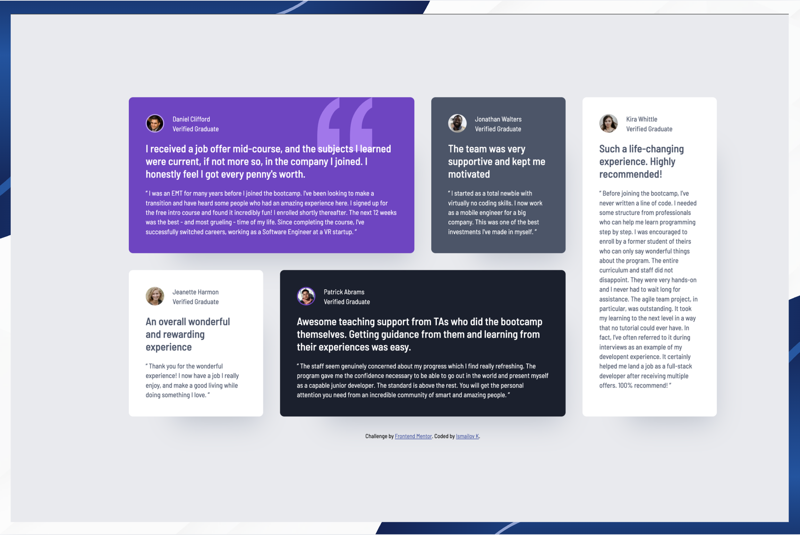

# Frontend Mentor - Testimonials grid section solution

### Screenshot



This is a solution to the [Testimonials grid section challenge on Frontend Mentor](https://www.frontendmentor.io/challenges/testimonials-grid-section-Nnw6J7Un7). Frontend Mentor challenges help you improve your coding skills by building realistic projects.

## Table of contents

  - [Screenshot](#screenshot)

- [Overview](#overview)
  - [The challenge](#the-challenge)
  - [Links](#links)
- [My process](#my-process)
  - [Built with](#built-with)
  - [What I learned](#what-i-learned)
  - [Continued development](#continued-development)
  - [Useful resources](#useful-resources)
  - [AI Collaboration](#ai-collaboration)
- [Author](#author)

## Overview

### The challenge

Users should be able to:

- View the optimal layout for the site depending on their device's screen size


### Links

- Solution URL: [Add solution URL here](https://github.com/Ismail-SWE/Testimonials-grid-section)
- Live Site URL: [Add live site URL here]( https://ismail-swe.github.io/Testimonials-grid-section/)

## My process

### Built with

- Semantic HTML5 markup
- CSS Grid
- Flexbox
- Mobile-first workflow
- Google Fonts (Barlow Semi Condensed)

### What I learned

**1. CSS Grid layout with spanning**

This was my first time using `grid-column: span` and `grid-row: span` to make cards occupy multiple columns or rows. I learned that a 4-column grid gives enough flexibility to create an asymmetric, visually interesting layout.

```css
section {
  display: grid;
  grid-template-columns: repeat(4, 1fr);
  gap: 32px;
}

.card__first  { grid-column: span 2; }
.card__fourth { grid-column: span 2; }
.card__fifth  { grid-column: 4; grid-row: 1 / 3; }
```

**2. Semantic HTML — `article` vs `div`**

I learned that each testimonial card should use `article` instead of `div`, because each card is a self-contained piece of content that makes sense on its own. This also improves accessibility for screen readers.

**3. Structuring the author profile block**

I learned to wrap the avatar image and the author text in a parent `div` so that Flexbox can align them side by side cleanly:

```html
<div class="author__info">
  
  <div>
    <p class="author__name">Daniel Clifford</p>
    <p class="author__subtitle">Verified Graduate</p>
  </div>
</div>
```

**4. Background image as a decorative element**

I learned how to place a decorative SVG quotation mark as a `background-image` on a card, using `background-position` to control its exact placement without it interfering with the text content.

```css
.card__first {
  background-image: url(images/bg-pattern-quotation.svg);
  background-repeat: no-repeat;
  background-position: top right 80px;
}
```

**5. `box-shadow` for card depth**

I learned how the four `box-shadow` values (x-offset, y-offset, blur, spread) work together to create a subtle depth effect under cards.

```css
article {
  box-shadow: 40px 60px 50px -47px rgba(72, 85, 106, 0.25);
}
```

**6. Centering a fixed-width layout**

I learned that combining `display: flex`, `align-items: center`, `justify-content: center` on `body` is the cleanest way to center a fixed-width section both horizontally and vertically on the page.

### Continued development

- I want to practice **mobile-first responsive design** using media queries, so the grid collapses gracefully on smaller screens.
- I want to get more comfortable with **CSS custom properties** (`--variables`) to manage colors and font sizes in one place instead of repeating values.
- I want to explore **CSS Grid's `grid-template-areas`** property as an alternative way to define complex layouts more readably.

### Useful resources

- [CSS Grid Guide — CSS Tricks](https://css-tricks.com/snippets/css/complete-guide-grid/) - The most comprehensive reference for CSS Grid. I used it to understand `span`, `grid-column`, and `grid-row`.
- [MDN — box-shadow](https://developer.mozilla.org/en-US/docs/Web/CSS/box-shadow) - Helped me understand each value of the `box-shadow` property.
- [MDN — background-position](https://developer.mozilla.org/en-US/docs/Web/CSS/background-position) - Helped me position the decorative quotation SVG correctly.

### AI Collaboration

I used **Claude (Anthropic)** as a learning assistant throughout this project.

- **How I used it:** I did not ask Claude to write the code for me. Instead, I asked questions at each step — about HTML structure, which semantic tags to use, how CSS Grid works, and why certain layout decisions are made. Claude reviewed my code and pointed out mistakes like a missing `article` wrapper, a typo in a class name (`auhtor__subtitle`), and incorrect grid column counts.
- **What worked well:** Getting immediate feedback on my code at each stage helped me catch mistakes early and understand *why* something was wrong, not just *what* was wrong.
- **What I would do differently:** Next time I want to attempt more steps independently before asking for guidance, to strengthen my problem-solving skills.

## Author

- Frontend Mentor - [@yourusername](https://www.frontendmentor.io/profile/yourusername)